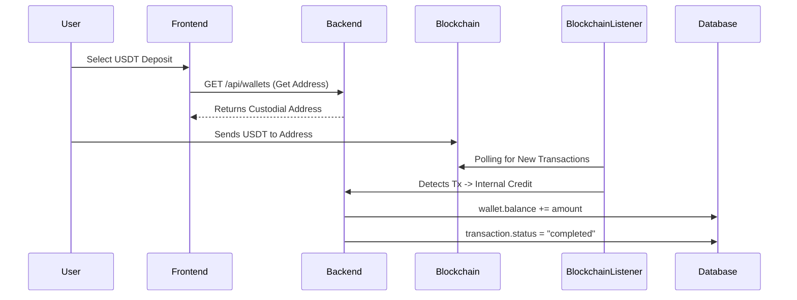
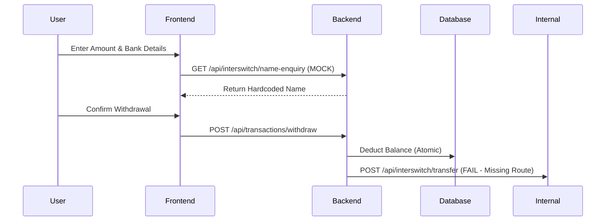

# StableX Project: Functions, Flows, and Audit Report

This document provides a comprehensive overview of the StableX application, its integrated features, process flows, and current implementation status (Real vs. Mock).

## 🚀 Core Functionalities

### 1. Authentication & Security
- **Signup/Login**: Standard JWT-based authentication.
- **OTP Verification**: Real integration with Gmail SMTP via Nodemailer.
- **Custodial Architecture**: Private keys are managed server-side and encrypted; never exposed to the frontend.
- **Wallet Generation**: HD Wallet derivation (BTC, ETH, TRX, etc.) using `@scure/bip39`.

### 2. Fiat Deposits (NGN)
- **Channels**: Card Payment, Bank Transfer (Virtual Account), USSD, and Web Checkout (Interswitch).
- **Process**:
    - Frontend registers a `pending` transaction.
    - Interswitch UI/API handles payment.
    - Backend receives Webhook OR performs GET-requery to confirm status.
    - `walletService.js` credits the user's NGN balance with idempotency checks.

### 3. Crypto Deposits
- **Process**:
    - User is assigned a unique custodial address.
    - Background Worker (`blockchainListener.js`) polls TronGrid/Blockstream APIs.
    - Upon detection, funds are swept to a Treasury/Hot wallet.
    - User's internal ledger balance is credited.

### 4. Swaps & Conversions
- **Process**: 
    - Real-time rates fetched from `priceService.js` (CoinGecko/Binance integrations).
    - Atomic exchange performed between User Wallet and Treasury Wallet using MongoDB Sessions.
    - Platform takes a configurable percentage spread (profit).

### 5. Withdrawals
- **Crypto Withdrawal**: Real automated broadcast to TRON/BTC networks from the Hot Wallet.
- **Fiat Withdrawal**: Backend attempts to call Interswitch Transfer API (Currently experiencing a route mismatch—see Audit).

---

## 🔄 Detailed Process Flows

### A. USDT (TRC20) Deposit Flow

### B. NGN Withdrawal Flow

---

## 🔍 Audit Report: Mocks & Placeholders

The following items are currently implemented as **Mocks** or **Placeholders** and require attention before production:

| Feature | Status | File Location | Rationale |
| :--- | :--- | :--- | :--- |
| **Name Enquiry** | 🟠 **MOCK** | `depositController.js` | Returns hardcoded "Ukeje Joseph" regardless of bank/account. |
| **Earn (Staking)** | 🔴 **MOCK** | `Earn.tsx` | UI discovery only. Buttons are disabled/Coming Soon. |
| **Gift Cards** | 🔴 **MOCK** | `Giftcard.tsx` | View-only placeholder with static data. |
| **Trade Discovery** | 🟡 **UI-ONLY** | `Trade.tsx` | Hardcoded coin list/prices; no actual order book. |
| **Swap Rates** | 🟡 **HYBRID** | `Convert.tsx` | Backend is real, but frontend has hardcoded fallback rates if API fails. |
| **NGN Withdrawal**| ❌ **BROKEN** | `transactions.js` | Calls `/api/interswitch/transfer` which is not defined in routes. |

### Immediate Action Required:
> [!WARNING]
> **Fiat Withdrawal Route Mismatch**: The backend in `transactions.js` (line 531) attempts to fetch a local endpoint `/api/interswitch/transfer` to execute the bank transfer. This route is **NOT** defined in `interswitch.js`, meaning NGN withdrawals will likely fail with a 404 error even if the balance logic is correct.

---

## 🛠️ Suggestions for Production
1. **Name Enquiry**: Replace the mock in `depositController.js` with a real call to Interswitch Name Enquiry API.
2. **Withdrawal Endpoint**: Properly define the `/transfer` route in `interswitch.js` and link it to the Interswitch Payout service.
3. **Price Service**: Ensure `priceService.js` has robust fallback APIs (e.g., Binance + CoinGecko) to prevent using hardcoded fallback rates in `Convert.tsx`.
